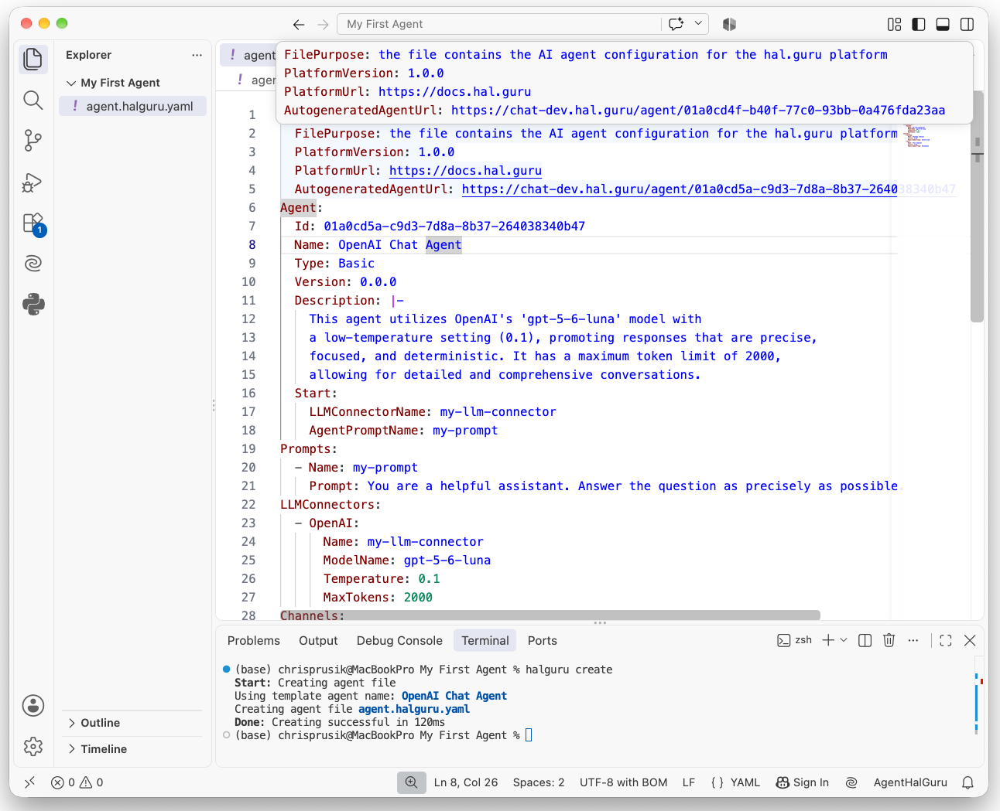

Pre-requisite steps: [Environment configured](../preparing-your-environment/index.md)

### Initializing the Agent

Follow these streamlined steps to create and configure your agent workspace efficiently:

1. Launch Visual Studio Code by entering `code` in your terminal or opening it from your applications menu.
2. Open your project workspace by navigating to **File** -> **Open Folder...** (or pressing `Ctrl+K Ctrl+O` / `Cmd+O` on macOS for quick navigation).
   - For a new project, create a dedicated folder (e.g., `My First Agent`).
   - Click **Open** (or **Select Folder**) to confirm.
3. In the **Explorer** panel on the left, right-click the folder space and select **Open in Integrated Terminal** (or use the shortcut `Ctrl+`` / ``Cmd+``).
4. In the integrated terminal prompt, initialize the agent by running:
   ```bash
   halguru create
   ```
5. In the Explorer view, locate and open the newly generated agent.halguru.yaml configuration file.

Your screen should now display a layout similar to the following:



### Pierwsze uruchomienie

Aby uruchomić agenta lokalnie, w terminalu wpisz polecenie `halguru talk`.
