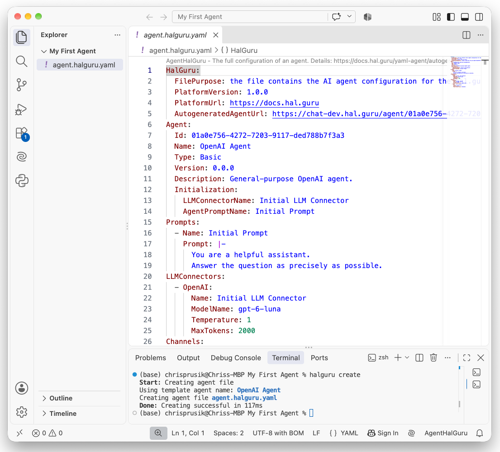

Pre-requisite steps: [Environment configured](../preparing-your-environment/index.md)

### Initializing the Agent

Follow these streamlined steps to create and configure your agent workspace efficiently:

1. Launch Visual Studio Code by entering `code` in your terminal or opening it from your applications menu.
2. Open your project workspace by navigating to **File** -> **Open Folder...** (or pressing `Ctrl+K Ctrl+O` / `Cmd+O` on macOS for quick navigation).
   - For a new project, create a dedicated folder (e.g., `My First Agent`).
   - Click **Open** (or **Select Folder**) to confirm.
3. In the **Explorer** panel on the left, right-click the folder space and select **Open in Integrated Terminal** (or use the shortcut `Ctrl+`` / ``Cmd+``).
4. In the integrated terminal prompt, initialize the agent by running:
   ```bash
   halguru create
   ```
5. In the Explorer view, locate and open the newly generated agent.halguru.yaml configuration file.

Your screen should now display a layout similar to the following:



### Running Your Agent for the First Time

To start and interact with your agent locally, enter the following command in your terminal:

```bash
halguru talk
```

To verify that the agent is functioning correctly, try asking a simple test question such as `2+2=`. 
The agent should respond with `4`. 
When you are finished, enter `q` (or `quit`) to safely terminate the conversation session.
```
Start: Conversation
Using agent file /Users/myaccount/Documents/My First Agent/agent.halguru.yaml
Using agent id: 01A0E756-4272-7203-9117-DED788B7F3A3, name: OpenAI Agent, version: 0.0.0
OpenAI Agent: Ready. What would you like to do?
Type q or quit to exit.
You: 2+2=
OpenAI Agent: 4
You: q
Done: Conversation has been finished
```
